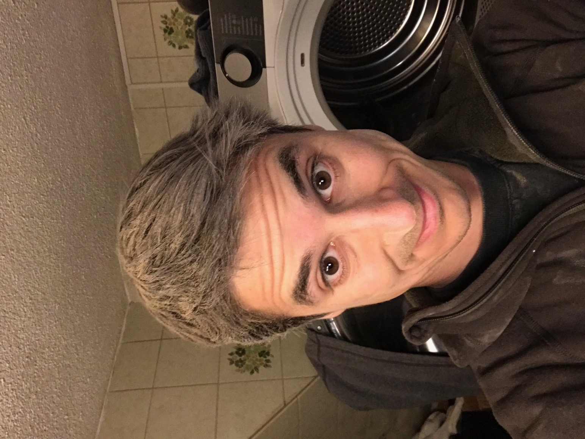
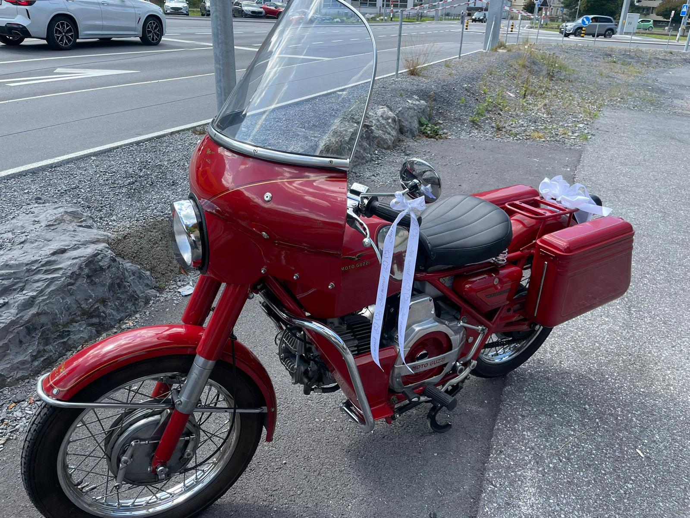
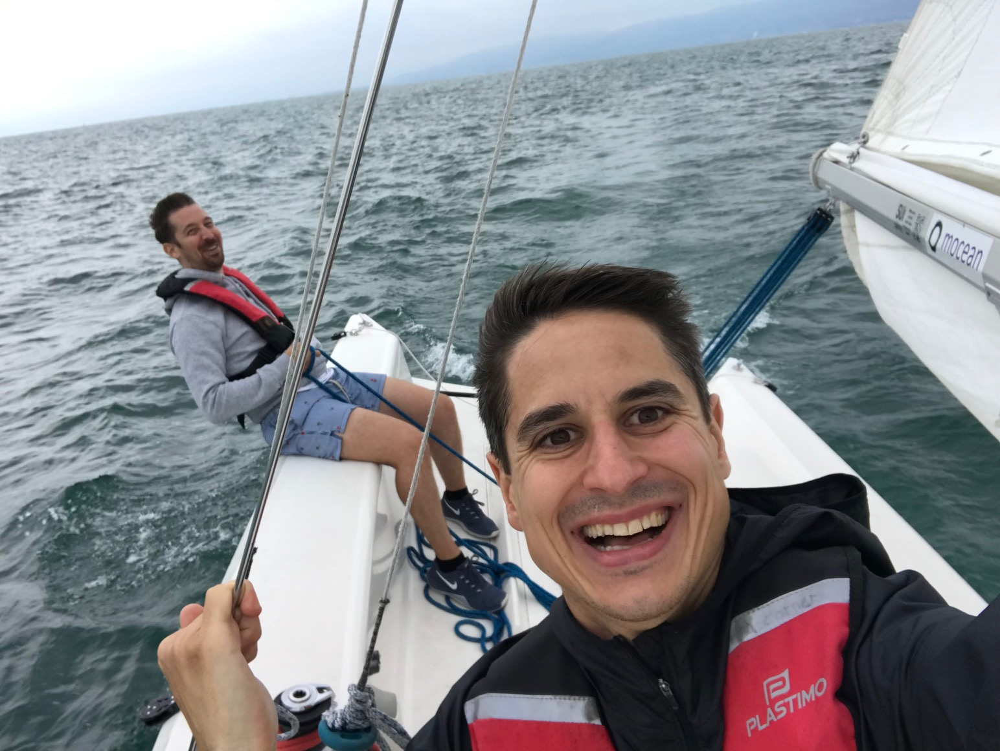
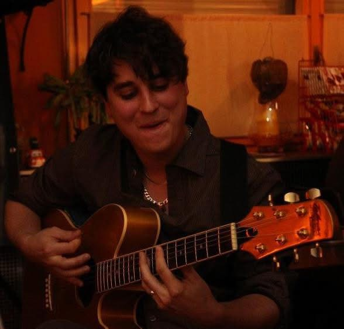
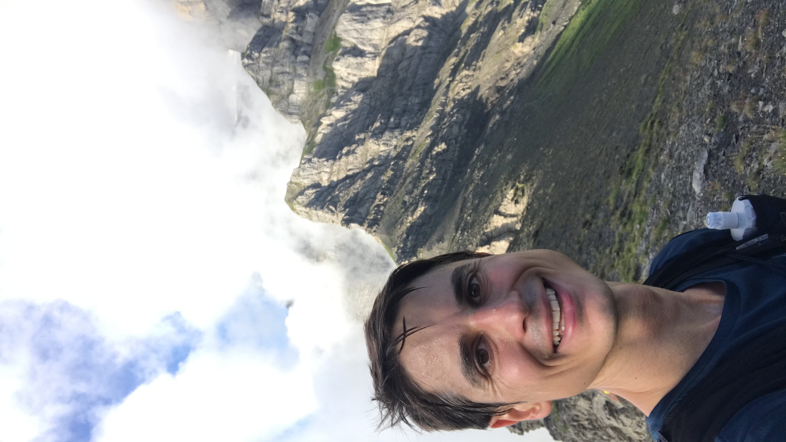
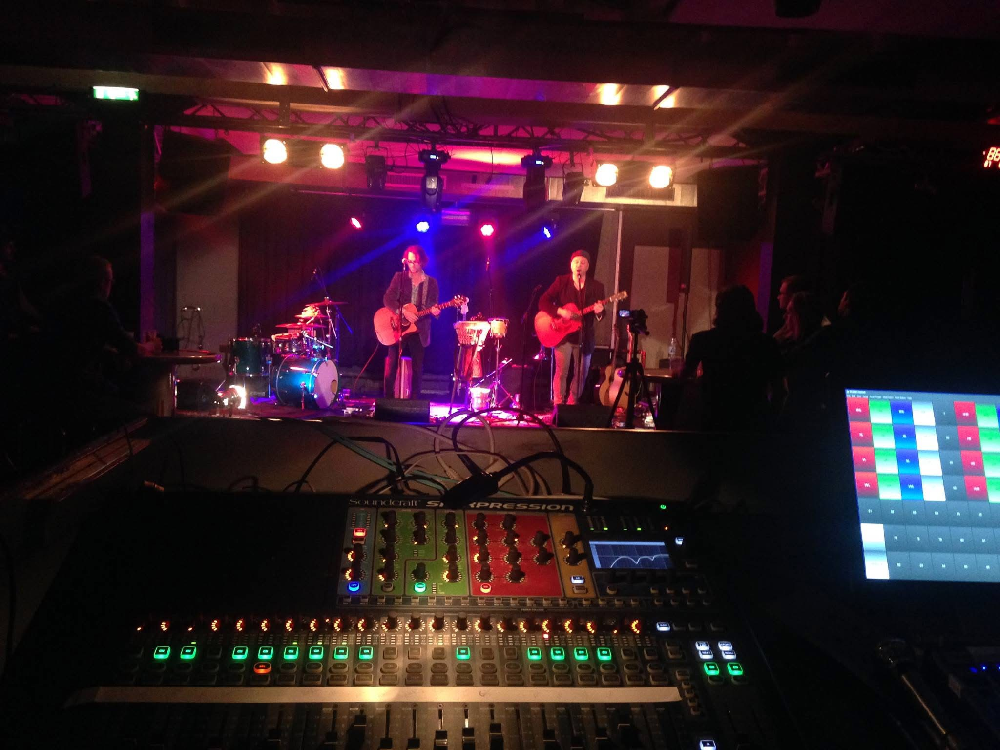
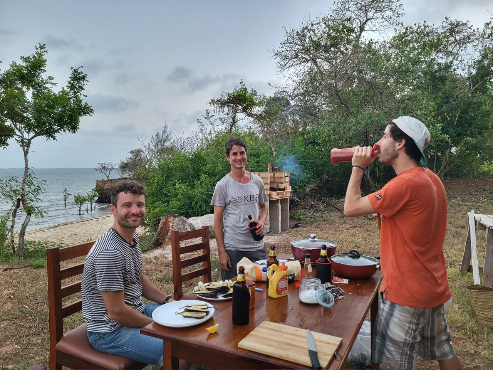
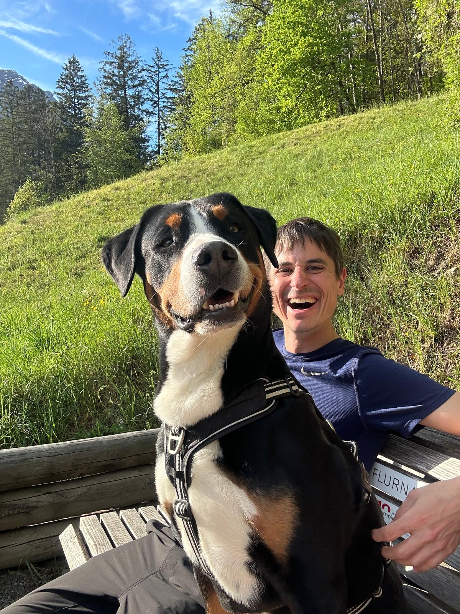
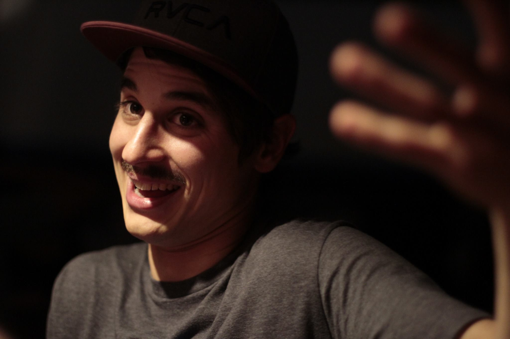

# Software Crafters Meetup

## Guter Code. Gutes Handwerk. Gutes Gewissen

---

# MarcoKuoni.ch

## Be a lifelong learner

---

# Humboldtsches Bildungsideal

## Bildung heisst, die Welt und sich selbst zu verstehen, um verantwortlich und frei handeln zu können

> **Wissen soll durch eigene Erfahrung, Reflexion und aktives Auseinandersetzen mit der Welt erlangt werden – um als freier, verantwortungsvoller Mensch handeln zu können.**

---

# Community of Practice

> **Eine Community of Practice ist eine Gruppe von Menschen, die regelmässig zusammenkommt, um durch Austausch und gemeinsames Tun besser in ihrem Fach zu werden.**

- Wissen teilen, Neues ausprobieren, voneinander lernen.

---

# Meine Vision

Wir wollen eine Community of Practice gründen – eine Gruppe von Softwareentwickler:innen, die sich regelmässig trifft, um gemeinsam besser zu werden.

Aber nicht nur technisch, sondern auch in unserer Haltung: sauberer Code, nachhaltige Lösungen, Verantwortung für Nutzer:innen und Gesellschaft.

Heute klären wir: **Was wollen wir erreichen? Welche Formate motivieren uns? Welche Themen und Werte sind uns wichtig?**

Ziel ist es, dass wir alle voneinander lernen und mit einem guten Gefühl nach Hause gehen, weil wir nicht nur Software, sondern auch uns selbst weiterentwickeln.

---

✨ Neu: Software Crafters Community of Practice

Wir wollen mehr als funktionierende Software – wir wollen gute Software, verantwortungsvoll entwickelt.

💡 Was erwartet dich?

    Lightning Talks, Coding Katas, Mob Programming, Diskussionen

    Austausch über Clean Code, Testing, Open Source, Nachhaltigkeit, Verantwortung

    Raum zum Lernen, Experimentieren und Hinterfragen

🗓️ Kickoff: [Datum, Uhrzeit, Ort/Link]

👉 Mach mit!
Bring deine Ideen, Tools oder ethischen Fragen mit.
Melde dich hier an: [Link]

<!-- # SoftwareCraftsmanship #SoftwareCrafters #CommunityOfPractice #CleanCode #OpenSource #Nachhaltigkeit #EthikInDerIT -->

---

# 🚀 Kickoff Community of Practice

Gemeinsam gestalten, lernen und wachsen.

---

# 🎯 Ziele des Treffens

✅ Warum gibt es uns?  
✅ Was wollen wir tun?  
✅ Wie wollen wir arbeiten?

---

# 🤝 Was ist eine Community of Practice?

> **Eine Gruppe von Menschen, die regelmässig zusammenkommt, um durch Austausch und gemeinsames Tun besser in ihrem Fach zu werden.**

---

# 📅 Organisation & Ablauf

📝 **Fragen:**

- Wie oft treffen wir uns?
- Online, vor Ort, hybrid?
- Wie kommunizieren wir (Matrix, Mastodon, Meetup, GitLab)?
- Wer übernimmt welche Rollen?
- Wo werden Themas gsammelt?
- Feedback & Anpassungen?

---

# 🌟 Vision & Ziele

📝 **Fragen:**

- Warum wollen wir diese Community?
- Was wäre dein grösster Gewinn?
- Wie sieht Erfolg in 6 Monaten aus?

---

# 🛠️ Formate & Methoden

📝 **Fragen:**

- Welche Formate motivieren uns?  
  (⚡ Lightning Talks, 💻 Katas, 👥 Mob Programming, 💬 Diskussionen)
- Was wäre ein guter Startinhalt?

---

# 💡 Themen & Werte

📝 **Fragen:**

- Welche Themen wollen wir bearbeiten?
- Welche Werte sind uns wichtig?

---

# ✅ Next Steps

✔ Zusammenfassung der Ergebnisse  
✔ Nächstes Treffen & Thema festlegen  
✔ Verantwortlichkeiten klären

🙏 Vielen Dank!

<!--
https://marpit.marp.app
 marp slides.md -w --theme-set custom-theme.css
-->
